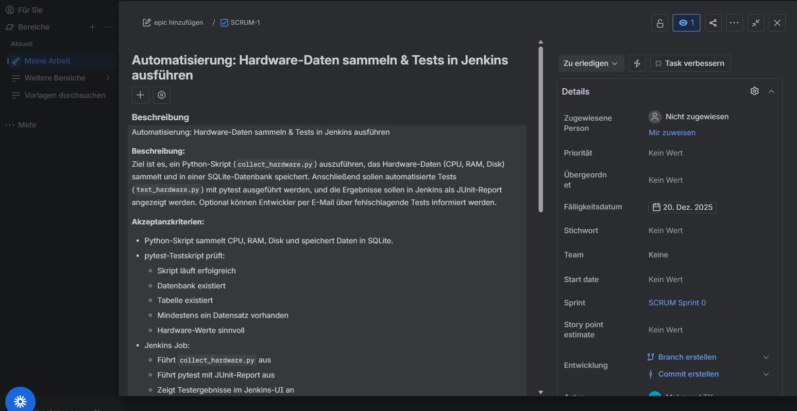
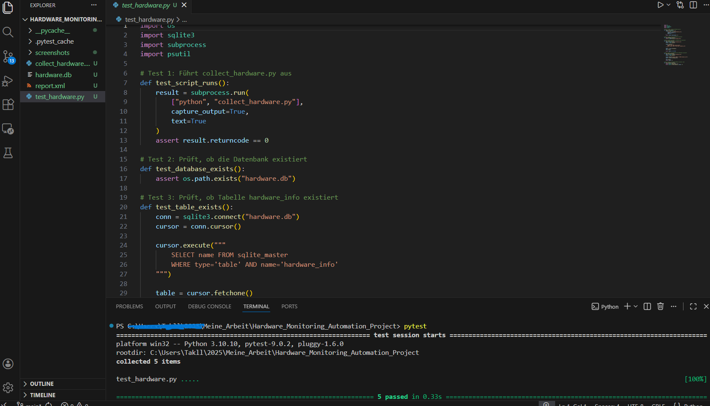
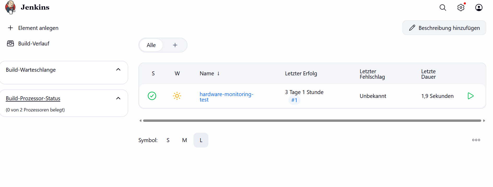
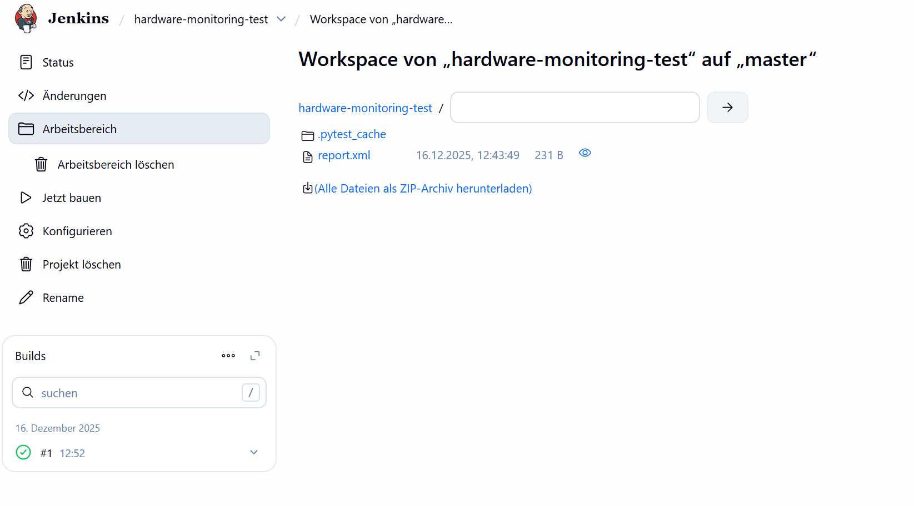
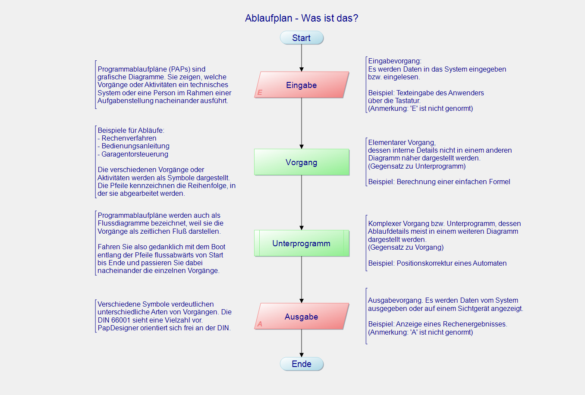

# Hardware Monitoring & Test Automation Project
This project demonstrates a simple and practical automation and testing workflow.
It focuses on collecting hardware information, running automated tests,
and visualizing the process using common DevOps and QA tools.
The project is intended to showcase structured thinking, automation, and basic testing concepts.
---
## Jira Ticket
The task was planned and tracked using a Jira ticket.
The ticket contains the task description, progress, and completion status.

---
## Test Results
The automated tests verify:
- successful execution of the hardware collection script
- creation of the database
- insertion of hardware data
- validity of collected hardware values

---
## Jenkins Job – Configuration and Execution
The Jenkins job automatically performs the following steps:
- Executes the Python script to collect hardware information
- Runs automated tests using pytest
- Generates a test result report
### Jenkins Build

### Jenkins Job Result

---
## Process Overview (Pap Designer)
The following flowchart is typically used to present and explain the project workflow.

---
## Technologies Used
- Python 3
- psutil
- SQLite
- pytest
- Jenkins
- Git / GitHub
- Jira
- Pap Designer (process flow diagram)
---
## Summary
This project demonstrates:
- task-based work using Jira
- automation with Jenkins
- basic automated testing with pytest
- clear documentation using Markdown
It represents a small but complete automation and testing workflow.
